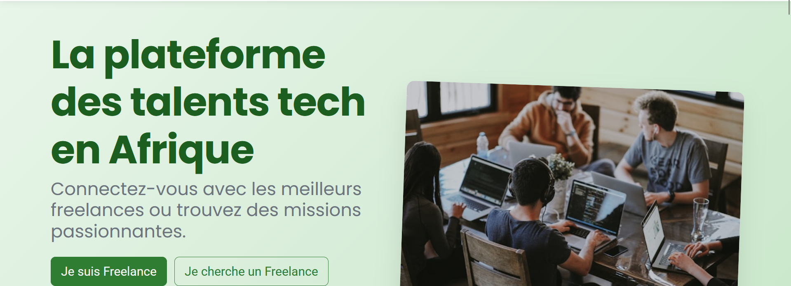
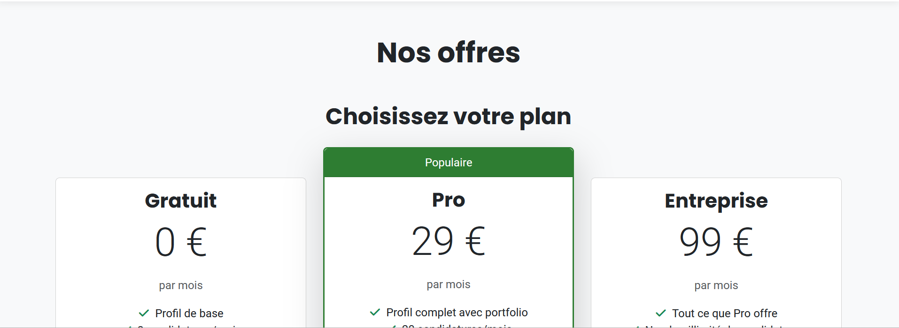
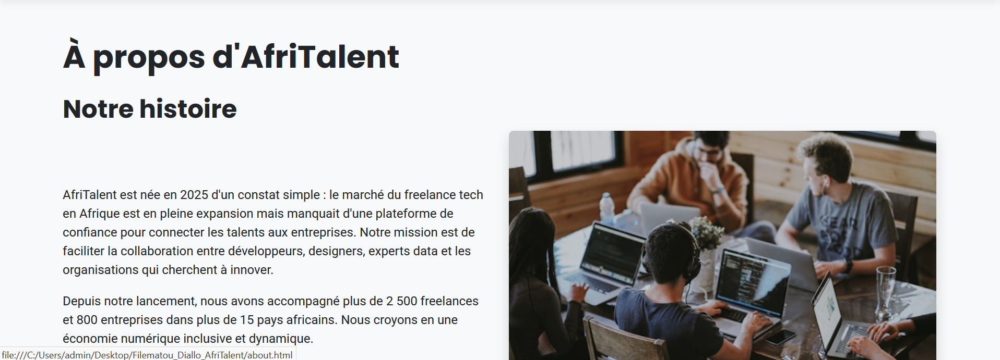
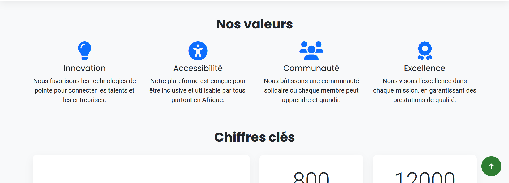
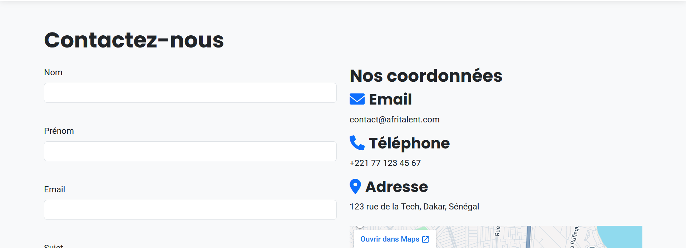

# AfriTalent – Plateforme de freelances tech en Afrique

## Auteur
Filematou Diallo – L1 Cs

## Description
AfriTalent est un site vitrine pour une plateforme fictive de mise en relation entre freelances tech et entreprises en Afrique.  
Le site présente la plateforme, ses fonctionnalités, ses tarifs, des profils de freelances, et permet de contacter l’équipe.  
Il a été conçu dans le cadre du projet de fin de semestre 2, en suivant les tendances web 2026 : design épuré, typographie expressive, Bento Grid, accessibilité, et interactivité JavaScript.

## Technologies utilisées
- **HTML5** sémantique – structure rigoureuse, accessibilité (attributs `alt`, `aria-*`, rôles)
- **CSS3** – Flexbox, Grid, Bento Grid, animations CSS, transitions, responsive design, variables CSS, Google Fonts
- **Bootstrap 5** – système de grille, composants (navbar, cards, carousel, accordion, modal), personnalisation
- **JavaScript (vanilla)** – manipulation du DOM, événements, validation de formulaire, filtres dynamiques, dark mode, compteurs animés, scroll animations
- **Git & GitHub** – versionnement, commits réguliers, déploiement via GitHub Pages

## Fonctionnalités principales
- Navigation responsive avec navbar fixe et changement de style au scroll
- Thème clair/sombre avec persistance via `localStorage`
- Compteurs animés au scroll (IntersectionObserver)
- Filtrage dynamique des freelances par catégorie (sans rechargement)
- Validation complète du formulaire de contact (champs requis, email, message ≥20 caractères)
- Animations fade-in des sections au scroll
- Bouton retour en haut avec smooth scroll
- Année dynamique dans le copyright du footer

## Captures d’écran
ta

> **Note :** Les captures d’écran sont disponibles dans le dossier `screenshots/`.

## Lien vers le site
[https://filematoudiallo89-maker.github.io/Filematou_Diallo_AfriTalent/](https://filematoudiallo89-maker.github.io/Filematou_Diallo_AfriTalent/)

## Instructions pour lancer localement
1. Clonez le dépôt :  
   `git clone https://github.com/filematoudiallo89-maker/Filematou_Diallo_AfriTalent.git
2. Ouvrez le fichier `index.html` dans votre navigateur (ou utilisez un serveur local comme Live Server).

## Ressources consultées
- [MDN Web Docs](https://developer.mozilla.org/fr/) – référence HTML, CSS, JavaScript
- [Bootstrap 5 Documentation](https://getbootstrap.com/docs/5.3/) – composants et grille
- [CSS-Tricks](https://css-tricks.com/) – guides Flexbox, Grid, CSS avancé
- [Google Fonts](https://fonts.google.com/) – polices de caractères
- [Font Awesome](https://fontawesome.com/) – icônes
- [Unsplash](https://unsplash.com/) – images libres de droits
- [Coolors](https://coolors.co/) – générateur de palettes de couleurs

## Remerciements
Projet réalisé dans le cadre de la formation [Nom de la formation], sous la supervision de [Nom du formateur].

---
**© 2026 – AfriTalent. Tous droits réservés.**